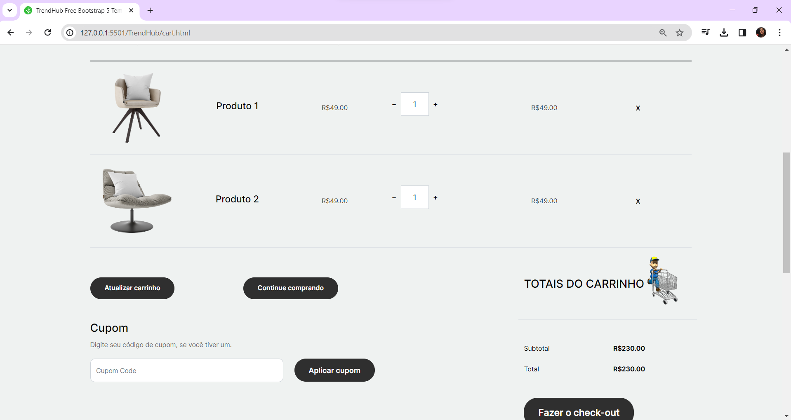

## Projeto Front-end Simples Apenas Visual 🚀

 

**Descrição**

:heavy_check_mark:**Faça um fork desta aventura**;\
:heavy_check_mark:**Crie uma branch: git checkout -b feature/feature-épica**;\
:heavy_check_mark:**Faça commits heroicos: git commit -m 'Adiciona funcionalidade épica**;\
:heavy_check_mark:**Envie para a branch: git push origin feature/feature-épica**;\
:heavy_check_mark:**Abra um portal dimensional chamado Pull Request e surpreenda-nos!**;\

 

Este projeto é protegido por uma Licença Mágica - confira o arquivo LICENSE.md para conhecer os detalhes.

Contato
Dúvidas, ideias ou apenas quer compartilhar sua jornada? Estamos sempre disponíveis:

:heavy_check_mark:**Projeto desenvolvido simples só para teste de algumas funcionalidades**

 

## Imagens do Projeto

 

](PRINTS/Imagem_tela_principal.png)

 

 

 

](PRINTS/Mais_informacoes.png)

 

## 🤝 Desenvolvedor

Software Front end

<table>
  <tr>
    <td align="center">
      <a href="#">
         
        
          <b>Clara Lemos</b>
        
      </a>
    </td>
  </tr>
</table>

## 📝 Licença
Este projeto está sob licença. Consulte o arquivo [LICENSE](LICENSE) para obter mais detalhes.

&#xa0;

<a href="#top">Volte para o topo</a>